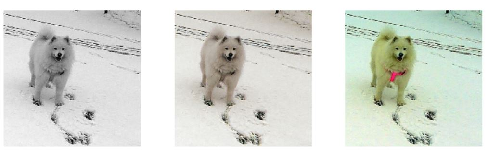
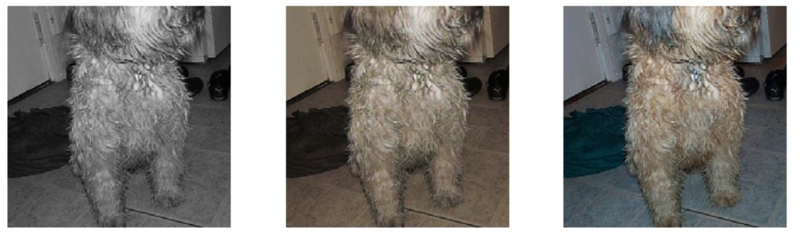
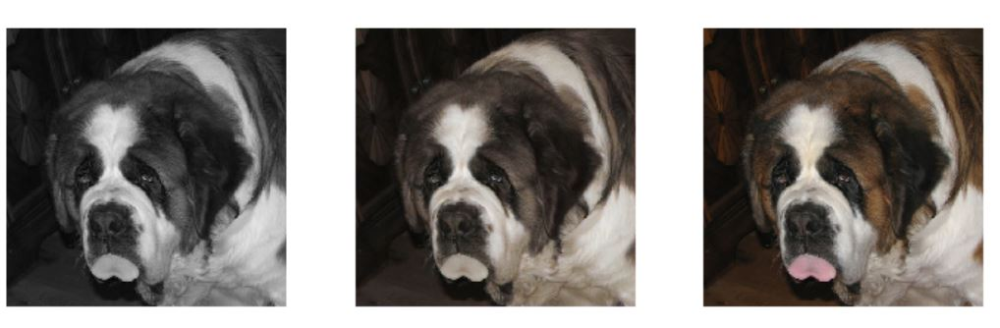
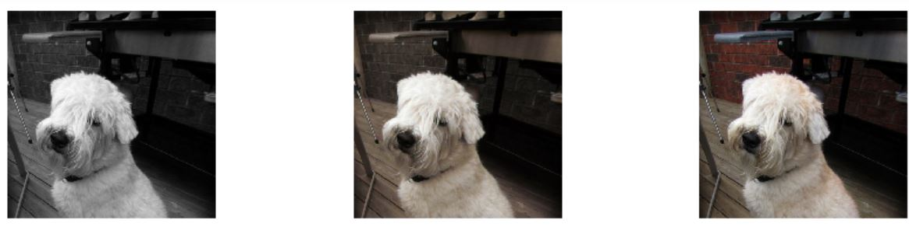
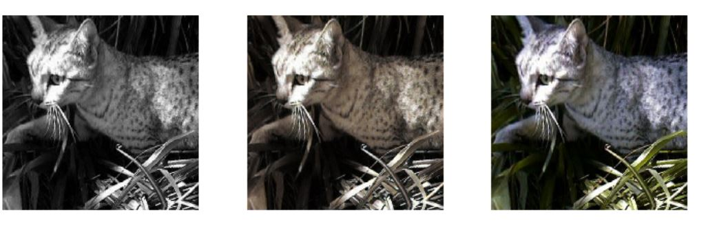
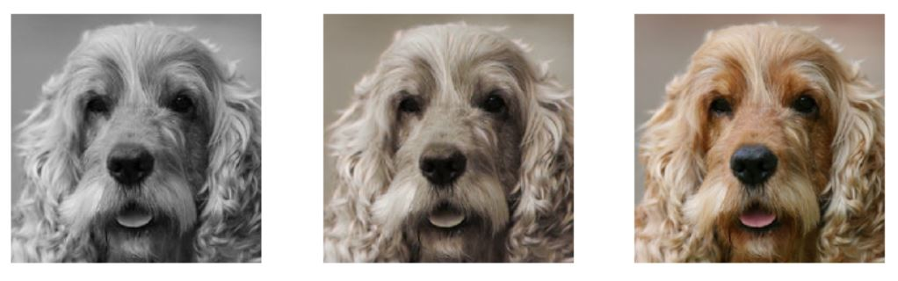
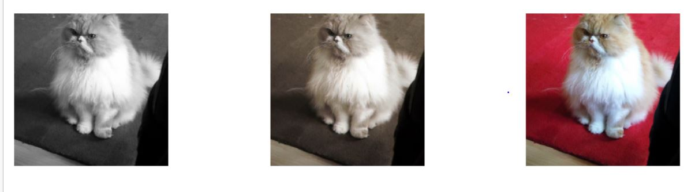
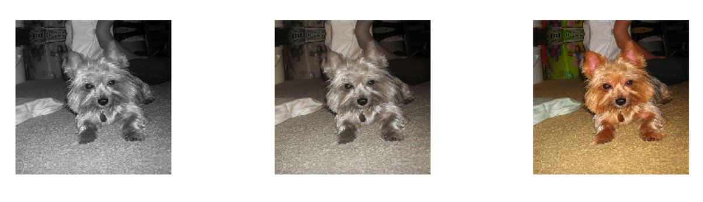
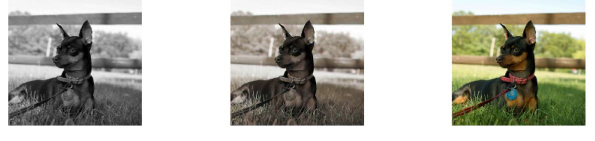

# Img-colorization
Converted images from grayscale to color using a unet style architecture, with a resnet 34 as an encode and a decoder for the unet. The loss function was based on the paper [Perceptual Losses for Real-Time Style Transfer and Super-Resolution](https://arxiv.org/abs/1603.08155). In essence they use the weights of a pretrained vgg16 model(with BatchNorm) to calculate a loss from the features. The whole idea was based on the same ground as for the [Image enhancement repo](https://github.com/prats0599/Image-Enhancer.git). The results obtained were mixed and a few of them are displayed below:  
They are in order of **Input/Prediction/Actual**  
**The good**   

**Okay-ish** 

  
**The bad**

  
As we can see, the model doesn't really focus much on improving the background of the images. Several images end up looking dull after the grayscale version is passed through the model, like some kind of yellow-ish filter applied on the real image. However, it does a good enough job on some of the images. I'm really hoping to improve the results in the future.   
  
This project was inspired from [Jason Antic's Deoldify](https://github.com/jantic/DeOldify). 
